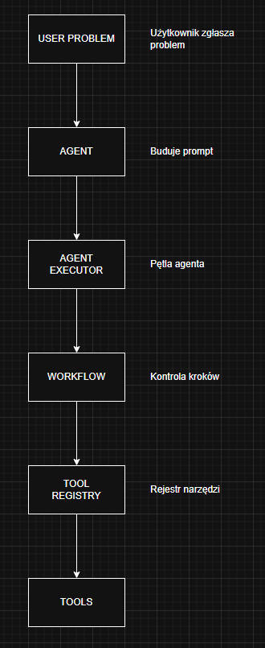
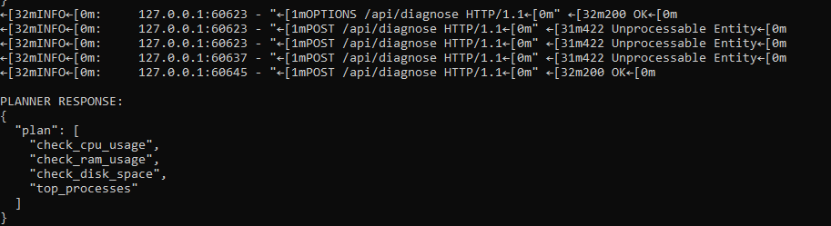

# Lumos Agent

Agent diagnostyczny systemu Windows zbierający informacje o stanie komputera.
Jego zadaniem jest analiza podstawowych parametrów wydajnościowych oraz dostarczanie danych do systemów monitoringu lub narzędzi AI (np. SolveDesk).

Agent może być używany jako część większego systemu diagnostycznego lub jako samodzielne narzędzie do sprawdzania wydajności stacji roboczej.

---

# Funkcjonalności

Agent umożliwia odczyt podstawowych parametrów systemu:

### 1. Użycie pamięci RAM

* całkowita ilość pamięci RAM
* procentowe użycie pamięci

### 2. Użycie procesora

* aktualne użycie CPU w procentach

### 3. Zajętość dysku

* całkowita pojemność dysku
* procent zajętej przestrzeni

### 4. Najbardziej obciążające procesy

* lista procesów
* PID procesu
* nazwa procesu
* użycie CPU

Agent zwraca **5 najbardziej obciążających procesów**.

---

# Architektura

Agent składa się z serwisu diagnostycznego:

```
DiagnoseService
```

Odpowiada on za komunikację z systemem operacyjnym poprzez bibliotekę **psutil**.

Dostępne metody:

| Metoda               | Opis                                            |
| -------------------- | ----------------------------------------------- |
| `check_ram_usage()`  | Zwraca informacje o użyciu RAM                  |
| `check_cpu_usage()`  | Zwraca aktualne użycie CPU                      |
| `check_disk_space()` | Zwraca informacje o wykorzystaniu dysku         |
| `top_processes()`    | Zwraca listę najbardziej obciążających procesów |

---



# Wymagania

## Python

Python 3.9+

## Biblioteki Python

```
psutil
```

Instalacja:

```
pip install psutil
```

---

## Lokalny model LLM

Agent może współpracować z lokalnym modelem językowym uruchamianym przez **Ollama**.

W projekcie wykorzystywany jest model:

* **qwen2.5:3b**

### Instalacja Ollama

Pobierz i zainstaluj Ollama:

https://ollama.com

### Pobranie modelu

```
ollama pull qwen2.5:3b
```

### Uruchomienie serwera Ollama

```
ollama serve
```

Domyślnie API Ollama działa pod adresem:

```
http://localhost:11434
```

Agent wykorzystuje to API do komunikacji z modelem LLM w celu planowania operacji diagnostycznych oraz interpretacji wyników systemowych.


---

# Uruchomienie

Przykładowe użycie:

```python
python -m venv venv
venv\Scripts\activate

python main.py
```

Przykładowy wynik:

Badanie
```json
{"type": "plan", "content": ["check_cpu_usage", "check_ram_usage", "check_disk_space", "top_processes"]}
{"type": "observation", "content": {"tool": "check_cpu_usage", "result": {"cpu_usage_percent": 12.5}}}
{"type": "observation", "content": {"tool": "check_ram_usage", "result": {"ram_total_gb": 15.72, "ram_used_percent": 75.3}}}
{"type": "observation", "content": {"tool": "check_disk_space", "result": {"disk_total_gb": 237.76, "disk_used_percent": 92.0}}}
{"type": "observation", "content": {"tool": "top_processes", "result": [{"name": "System Idle Process", "cpu_percent": 0.0, "pid": 0}, {"name": "System", "cpu_percent": 0.0, "pid": 4}, {"name": "Registry", "cpu_percent": 0.0, "pid": 156}, {"name": "Code.exe", "cpu_percent": 0.0, "pid": 160}, {"name": "smss.exe", "cpu_percent": 0.0, "pid": 520}]}}
```

Diagnoza
```json
{"type": "summary", "content": "Podsumowuj\u0105c wyniki diagnostyki, wykazano, \u017ce u\u017cytkownik ma pewne problemy ze stopniem wykorzystania zasob\u00f3w na komputerze. Oto g\u0142\u00f3wne wskaz\u00f3wki:\n\n1. **Za\u017cyczenie CPU**: Maszyna dzia\u0142a z 12,5% wy\u017cszego ni\u017c normalnego zasobu CPU. To nie jest niezaplanowany wysoki procent, ale mo\u017ce by\u0107 powodem, kt\u00f3ry zwi\u0119ksza konieczno\u015b\u0107 monitorowania i potencjalnie odkrycia problem\u00f3w.\n\n2. **Za\u017cyczenie pami\u0119ci RAM**: Komputer u\u017cywa 75,3% dost\u0119pnej pami\u0119ci RAM. [...] szczeg\u00f3\u0142owych analiz."}
```

---

# Przykładowe zastosowania

Agent może być używany w różnych scenariuszach:

1. **Diagnostyka wolno działającego komputera**
2. **Monitoring stacji roboczych**
3. **Automatyczna analiza problemów użytkownika**
4. **Integracja z systemami helpdesk**
5. **Źródło danych dla agentów AI**

---



# Integracja z Lumos

Przykład integracji z projektem Lumos - usługą systemową Windows magazynującą informację o wydajności stacji.
ConnectionString odpowiada ścieżce bezwzględnej do pliku lokalnego .db.

```python

def fetch_memory_ram_scan(self):
        query = text("""SELECT 
            AVG(TotalGB)     AS AvgTotalGB,
            AVG(UsedGB)      AS AvgUsedGB,
            AVG(FreeGB)      AS AvgFreeGB,
            AVG(UsedPercent) AS AvgUsedPercent
        FROM MemoryRamScans""")

        with self.engine.connect() as conn:
            result = conn.execute(query)
            rows = result.fetchall()

        return [dict(row._mapping) for row in rows]

```

```json

{"type": "observation", "content": {"tool": "check_ram_usage", "result": [{"AvgTotalGB": 15.720000000001031, "AvgUsedGB": 10.102186288332874, "AvgFreeGB": 5.6178137116672575, "AvgUsedPercent": 64.26475149806092}]}}

```

# Integracja z AI / SolveDesk

Agent może być wykorzystywany przez systemy AI do automatycznej diagnostyki problemów zgłaszanych przez użytkowników.

Przykład:

```
Użytkownik: "Komputer działa bardzo wolno"

AI Agent:
1. check_cpu_usage
2. check_ram_usage
3. top_processes
4. check_disk_space
```

Na podstawie wyników agent może wygenerować diagnozę, np.:

```
Wysokie użycie CPU przez proces Chrome (85%)
Rekomendacja: zamknąć nieużywane karty przeglądarki.
```

---

# Roadmap

Planowane rozszerzenia:

* monitorowanie temperatury CPU
* monitorowanie GPU
* sprawdzanie usług Windows
* monitorowanie sieci
* integracja z WMI

---

Dominik Hofman
