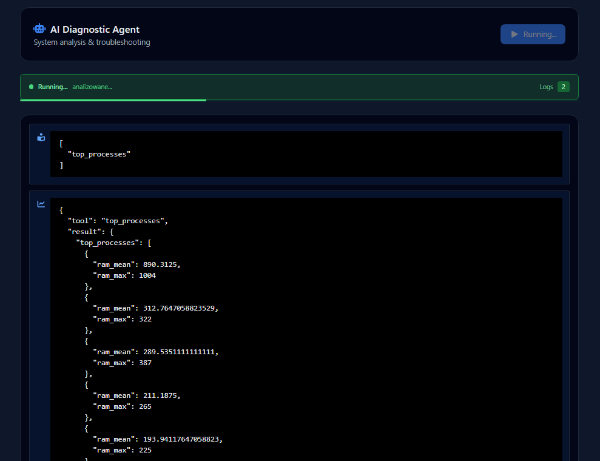
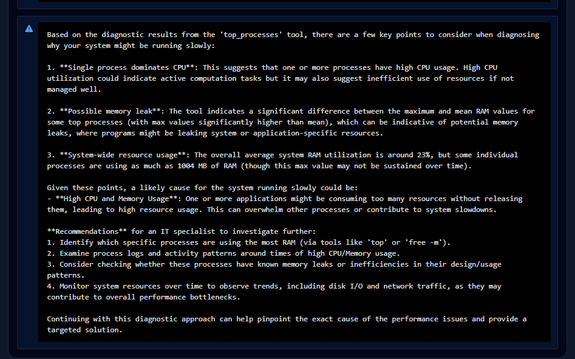

# Lumos Agent

Agent diagnostyczny systemu Windows zbierający informacje o stanie komputera.
Jego zadaniem jest analiza podstawowych parametrów wydajnościowych oraz dostarczanie danych do systemów monitoringu lub narzędzi AI (np. SolveDesk).

Agent może być używany jako część większego systemu diagnostycznego lub jako samodzielne narzędzie do sprawdzania wydajności stacji roboczej.

---

# Funkcjonalności

Agent umożliwia odczyt podstawowych parametrów systemu:

### 1. Użycie pamięci RAM

* całkowita ilość pamięci RAM
* procentowe użycie pamięci

### 2. Użycie procesora

* aktualne użycie CPU w procentach

### 3. Zajętość dysku

* całkowita pojemność dysku
* procent zajętej przestrzeni

### 4. Najbardziej obciążające procesy

* lista procesów
* PID procesu
* nazwa procesu
* użycie CPU

Agent zwraca **5 najbardziej obciążających procesów**.

---

# Architektura

Agent składa się z serwisu diagnostycznego:

```
DiagnoseService
```

Odpowiada on za komunikację z systemem operacyjnym poprzez bibliotekę **psutil**.

Dostępne metody:

| Metoda               | Opis                                            |
| -------------------- | ----------------------------------------------- |
| `check_ram_usage()`  | Zwraca informacje o użyciu RAM                  |
| `check_cpu_usage()`  | Zwraca aktualne użycie CPU                      |
| `check_disk_space()` | Zwraca informacje o wykorzystaniu dysku         |
| `top_processes()`    | Zwraca listę najbardziej obciążających procesów |

---


# Wymagania

## Python

Python 3.9+

## Biblioteki Python

```
psutil
```

Instalacja:

```
pip install psutil
```

---

## Lokalny model LLM

Agent może współpracować z lokalnym modelem językowym uruchamianym przez **Ollama**.

W projekcie wykorzystywany jest model:

* **qwen2.5:3b**

### Instalacja Ollama

Pobierz i zainstaluj Ollama:

https://ollama.com

### Pobranie modelu

```
ollama pull qwen2.5:3b
```

### Uruchomienie serwera Ollama

```
ollama serve
```

Domyślnie API Ollama działa pod adresem:

```
http://localhost:11434
```

Agent wykorzystuje to API do komunikacji z modelem LLM w celu planowania operacji diagnostycznych oraz interpretacji wyników systemowych.


---

# Uruchomienie

Przykładowe użycie:

```python
python -m venv venv
venv\Scripts\activate

python main.py
```

Przykładowy wynik:

Badanie
```json
{"type": "plan", "content": ["top_processes"]}
{"type": "observation", "content": {"tool": "top_processes", "result": {"top_processes": [{"ram_mean": 890.3125, "ram_max": 1004.0}, {"ram_mean": 312.7647058823529, "ram_max": 322.0}, {"ram_mean": 289.5351111111111, "ram_max": 387.0}, {"ram_mean": 211.1875, "ram_max": 265.0}, {"ram_mean": 193.94117647058823, "ram_max": 225.0}], "system": {"ram_avg": 22.74}, "issues": ["Single process dominates CPU", "Possible memory leak"]}}}
```

Diagnoza
```json
{"type": "summary", "content": "Problem z uruchamianiem komputera mo\u017ce by\u0107 skierowany do kilku czynnik\u00f3w, pod kt\u00f3re warto skupi\u0107 uwag\u0119. Oto podsumowanie:\n\n1. **Dominuj\u0105ca procedura procesora**: Wystarczaj\u0105co du\u017co pami\u0119ci (w tym maksymalnej 1004 MB) jest zmuszona do pracy przez jeden proces. Ta dominantna procedura mo\u017ce by\u0107 konkretnie okre\u015blana za pomoc\u0105 narz\u0119dzia `top_processes`, kt\u00f3re pokazuje, \u017ce jedna z tych procedur (prawdopodobnie uruchamiana aplikacja lub serwer) monopolizuje du\u017ce procent CPU.\n\n2. **Leki pami\u0119ci**: Wykryto potencjalne problemy ze strukturami pami\u0119ci \u2013 czyli mo\u017cliwe problemy zwi\u0105zane z leakem pami\u0119ci. Mo\u017ce by\u0107, \u017ce istnieje nieobslugiwany obiekt w pami\u0119ci, kt\u00f3ry spowodowa\u0142by trzymanie wi\u0119cej pami\u0119ci ni\u017c pozwala na to normale.\n\nPodsumowuj\u0105c, g\u0142\u00f3wn\u0105 przyczyn\u0105 tego problemu mo\u017ce by\u0107 dominuj\u0105ca procedura procesora, co prowadzi do monopolizacji du\u017cych procent CPU. Warto wi\u0119c skupi\u0107 si\u0119 na monitorowaniu obci\u0105\u017ce\u0144 i uruchamianych aplikacji, aby wskaza\u0107, kt\u00f3ry proces jest odpowiedzialny za maksymalne u\u017cycie prostrowy pami\u0119ci i procesora. Je\u015bli istnieje taka procedura, kt\u00f3ra monopolizuje du\u017ce liczby prostrowy pami\u0119ci (tj. > 50% CPU i > 1 GB RAM), to mo\u017ce by\u0107 to zazwyczaj odpowiedzialna za problem dzia\u0142a\u0144 wykraczaj\u0105cych na systemu.\n\nWa\u017cne jest r\u00f3wnie\u017c skupienie si\u0119 na sprawdzeniu struktur pami\u0119ci aplikacji i serwer\u00f3w, aby potencjalnie odnale\u017a\u0107 przyczyn\u0119 leaku pami\u0119ci."}
```

---

# Przykładowe zastosowania

Agent może być używany w różnych scenariuszach:

1. **Diagnostyka wolno działającego komputera**
2. **Monitoring stacji roboczych**
3. **Automatyczna analiza problemów użytkownika**
4. **Integracja z systemami helpdesk**
5. **Źródło danych dla agentów AI**

---


# Integracja z Lumos

Przykład integracji z projektem Lumos – usługą systemową Windows odpowiedzialną za gromadzenie informacji o wydajności stacji roboczej.

ConnectionString wskazuje bezwzględną ścieżkę do lokalnego pliku bazy danych .db.

W przedstawionym scenariuszu analizowane są aktywne procesy. Dane są pobierane z bazy i ładowane do obiektu DataFrame (biblioteka pandas), który stanowi warstwę analityczną aplikacji. Następnie, przy użyciu operacji grupowania i sortowania, wyznaczane są tzw. top procesy – na podstawie średniego oraz maksymalnego zużycia pamięci RAM.

Metoda detect_issues identyfikuje potencjalne problemy i zapisuje je w postaci krótkich komunikatów. Pełnią one rolę dodatkowego kontekstu dla modelu LLM, ułatwiając interpretację wyników.

Na końcu budowany jest ustrukturyzowany payload zawierający wyselekcjonowane metryki i wnioski, który trafia do modelu językowego w celu dalszej analizy i generowania rekomendacji.

```python

from pandas import DataFrame
from domain.abstracts.process_analysis_service import ProcessAnalysisService

class TopProcessesAnalitycs(ProcessAnalysisService):
    def __init__(self, loader):
        self.loader = loader

    def load_process_data(self) -> DataFrame:
        query = """SELECT 
            MachineGuid, 
            ProcessId, 
            ProcessName, 
            MemoryUsageMB, 
            CpuUsagePercent, 
            StartTime, 
            LastScan
        FROM Processes"""

        loaded_data = self.loader.read_data(query)
        return loaded_data
    

    def analyze_top_processes(self, df: DataFrame) -> DataFrame:
        grouped = df.groupby('ProcessName').agg({
            "MemoryUsageMB": ['mean', 'max']
        })

        grouped.columns = ['ram_mean', 'ram_max']
        grouped.reset_index()

        top_processes = grouped.sort_values(
            by=['ram_mean', 'ram_max'],
            ascending=[False, False]
        ).head()

        return top_processes, grouped
    

    def detect_issues(self, top_processes: DataFrame, grouped: DataFrame, df: DataFrame) -> list[str]:
        issues = []
        if top_processes.iloc[0]['ram_mean'] > 50:
            issues.append('Single process dominates CPU')

        if df['CpuUsagePercent'].mean() > 80:
            issues.append('High overall CPU usage')

        if grouped['ram_max'].max() > 2000:
            issues.append('Possible memory leak')

        return issues
    

    def build_llm_payload(self, top_processes: DataFrame, df: DataFrame, issues: list) -> dict:
        payload = {
            'top_processes': top_processes.to_dict(orient='records'),
            'system': {
                'ram_avg': df['MemoryUsageMB'].mean().round(2)
            },
            'issues': issues
        }

        return payload

```

```json

{"type": "observation", "content": {"tool": "top_processes", "result": {"top_processes": [{"ram_mean": 890.3125, "ram_max": 1004.0}, {"ram_mean": 312.7647058823529, "ram_max": 322.0}, {"ram_mean": 289.5351111111111, "ram_max": 387.0}, {"ram_mean": 211.1875, "ram_max": 265.0}, {"ram_mean": 193.94117647058823, "ram_max": 225.0}], "system": {"ram_avg": 22.74}, "issues": ["Single process dominates CPU", "Possible memory leak"]}}}

```

# Integracja z AI / SolveDesk

Agent może być wykorzystywany przez systemy AI do automatycznej diagnostyki problemów zgłaszanych przez użytkowników.

Przykład:

```
Użytkownik: "Komputer działa bardzo wolno"

AI Agent:
1. check_cpu_usage
2. check_ram_usage
3. top_processes
4. check_disk_space
```

Na podstawie wyników agent może wygenerować diagnozę, np.:

```
Wysokie użycie CPU przez proces Chrome (85%)
Rekomendacja: zamknąć nieużywane karty przeglądarki.
```

---

# Zrzuty ekranu





# Roadmap

Planowane rozszerzenia:

* monitorowanie temperatury CPU
* monitorowanie GPU
* sprawdzanie usług Windows
* monitorowanie sieci
* integracja z WMI

---

Dominik Hofman
